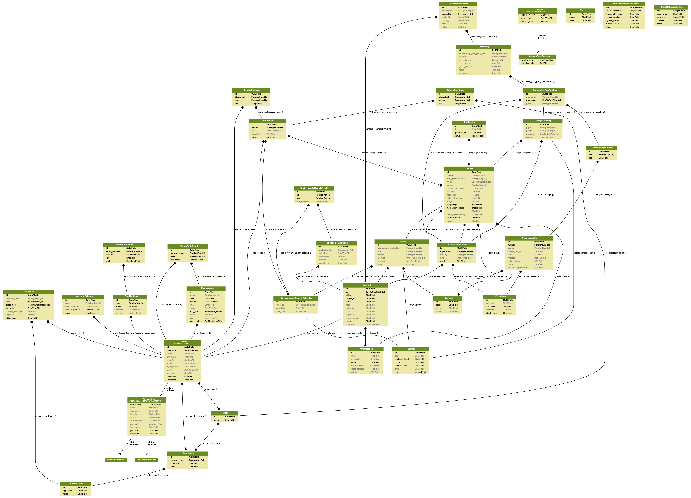

# CPT LIMS [](https://quay.io/repository/tamu_cpt/lims-backend)

Consists of:

- directory (people, organisations)
- project (project management, access to apollo / galaxy / chado)
- LIMS (web LIMS, barcoding, etc sol'n)

## Development Setup

You will need to have GDAL stuff available. (On debian, `apt-get install gdal-bin`)

Docker is a pre-requisite for this.

```
$ pip install -r requirements.txt
$ make pg_launch
# should print some ID number, you can ignore this
$ make pg_logs
# Lots of logging output, wait until you see "CREATE_EXTENSION" ~8 times, and
# then it says "database system is shut down" and then finally says "autovacuum
# launcher started"
$ make dj_fixtures
# This will load some default data into the databases
$ make dj_run
# Actually run the server, finally
```

## Project Layout

This project uses django apps in order to keep functionality small and separated cleanly:

- `account`
	- This app is used for a customizable account model. It is imported from pinax-accounts, and includes a lot of features we might or might not want someday (e.g. email validation).
	- We won't often need to touch this app
- `base`
	- uwsgi.py / settings.py
- `bioproject`
	- App for managing bioprojects which are essentially collections of samples.
	- A bioproject generally corresponds to a single "project" such as a 464 class, or Rohit's analysis
- `directory`
	- Views into the Users and Groups.
	- We also add a model called "organisation". User:Acount::Group:Organization. We need this secondary model in order to add extra properties to the group model.
- `fixtures`
	- pre-built data.
	- The goal is that 100% of the data in that folder can be created through the non-admin UI.
- `search`
	- Currently unused.
	- Someday will include a search implementation that covers the rest of the site. Inputting a genome ID should find the genome, and the associated samples / projects / etc.

## Database Schema


